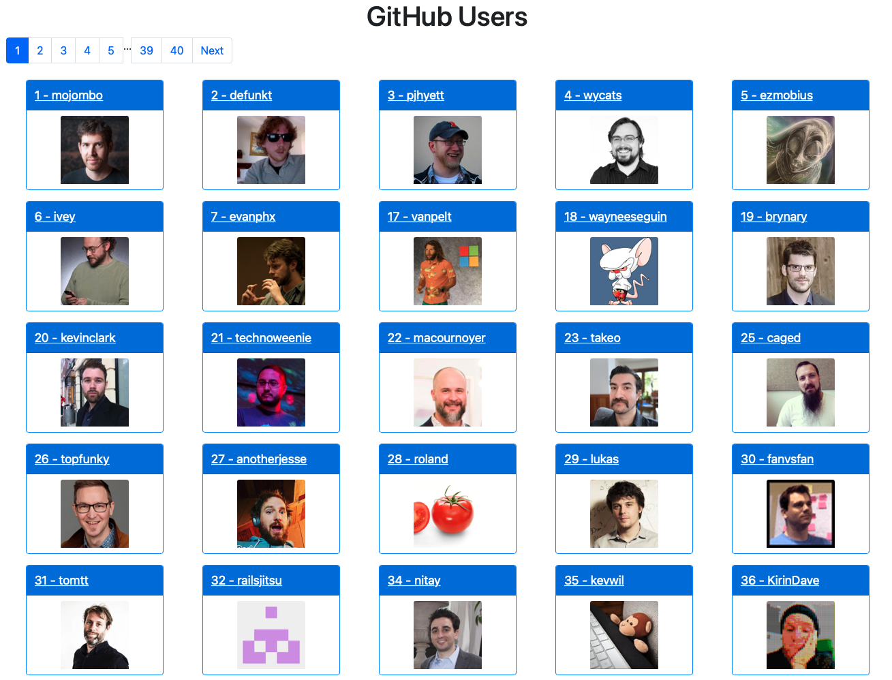
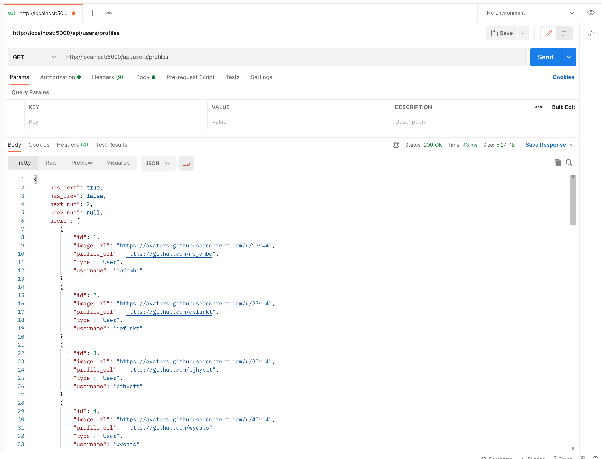
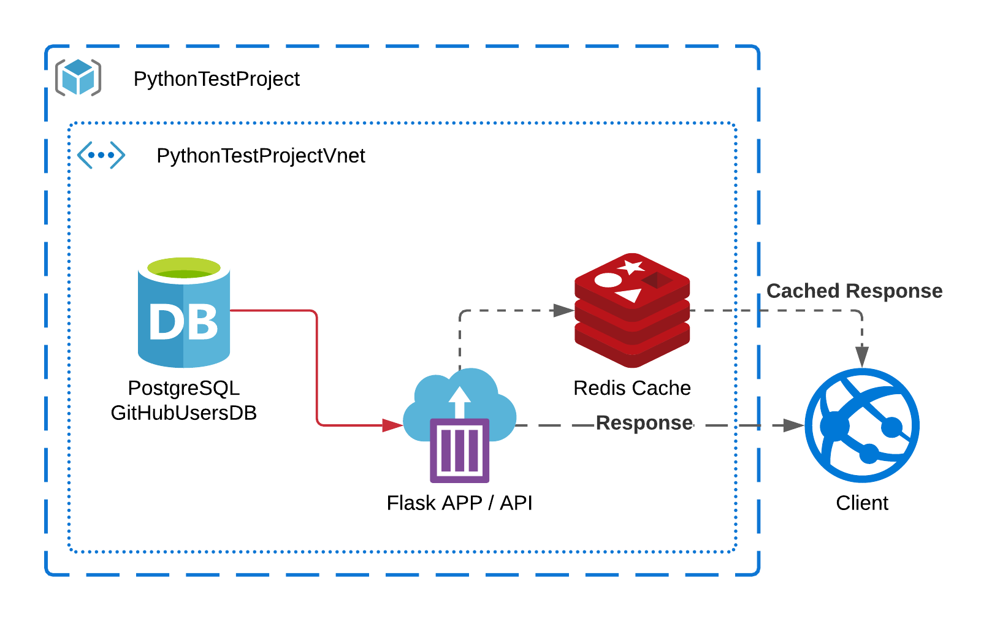
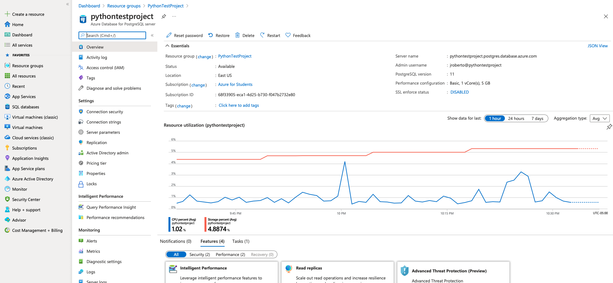
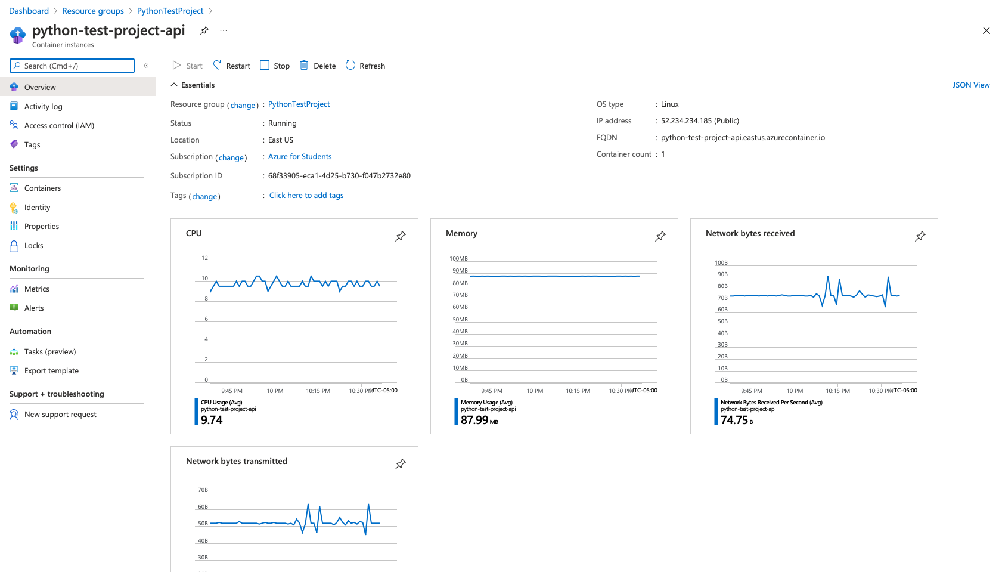
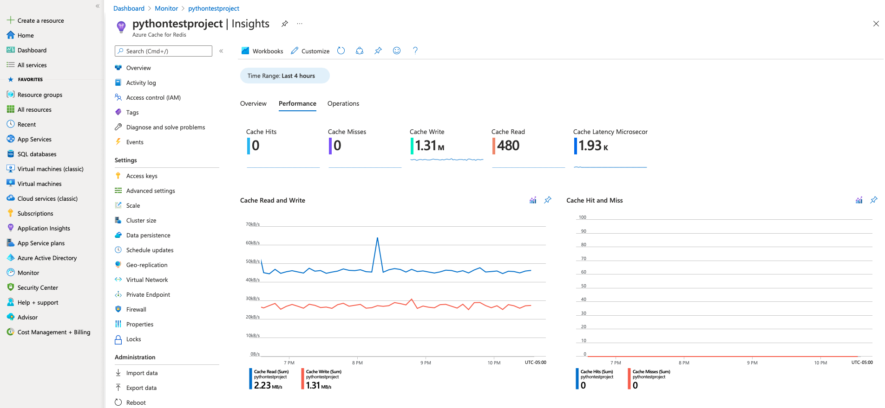

# Python Test
## Requirements & Development Setup

- Python 3.9
```bash
brew install python
```
- SQLite
```bash
brew install sqlite
```

Using `python 3.9` and `pip3`
```bash
pip3 install pipenv
pipenv shell
pipenv install
```

## Tests and DEV Start up
To create, initialize and seed the `sqlite` database:
```bash
# inside pipenv shell
# seed.py can take --total or -t to specify the number of users to seed
python ./scripts/seed.py -t <total>

# example
python ./scripts/seed.py --total 1000
```
This will create `github_users.db` file under `./app/main/database`

To test the project run:
```bash
# inside pipenv shell
python manage.py test
```

To run the project on localhost:
```bash
# inside pipenv shell
python manage.py run
```
This will start the application over [localhost:5000/users](0.0.0.0:5000/users)

### App


### API


# Usage

## Users View
Supports the following routes and operations:
```
localhost:5000/
localhost:5000/users?pagination=<limit>
localhost:5000/users/<int:page>
localhost:5000/users/<int:page>?pagination=<limit>
```

## Users API
Supports the following routes and operations:
```
# can be mixed and matched however they make sense
localhost:5000/api/users/profiles
localhost:5000/api/users/profiles?page=<page>
localhost:5000/api/users/profiles?pagination=<pagination>
localhost:5000/api/users/profiles?order_by=<id|type>
localhost:5000/api/users/profiles?username=<term>
localhost:5000/api/users/profiles?id=<id>
```

# Run as Container
The docker file to create the image to run the app as a container is straight forward. It adds some automation to the set up, and takes care of the dependencies, requirements and environment.
```Dockerfile
FROM python:3.9
WORKDIR /python_test
ADD . /python_test

RUN pip install psycopg2-binary
RUN pip install redis
RUN pip install pipenv
RUN pipenv install --system --deploy --ignore-pipfile
EXPOSE 5000
ENTRYPOINT [ "sh", "scripts/dev.sh" ]
```
To run using `docker`:
```bash
# to generate the image
docker build .
# to run the generated image
docker run -d -p 5000:5000 --name python_test <image_sha>
```
**NOTE: By default `scripts/dev.sh` calls `./scripts/seed.py` with no params. So container will run using a 150 users seed database.**

# Design
The application was design taking into consideration the low complexity requirements. Many sugar coated and more complex libraries were not used (like `Flask-RESTful`) to keep the application simple.

The application is both a `Flask API` and a `Flask UI` application. So the project is structured according to that. On `./app/main/controllers` we'll find API related controllers; and on `./app/main/views`, UI related enpoints that use templates.

### Mobile
Mobile support is achieved using `BootStrap` `CSS`. Which is imported from the `CDN` into the template. Though it is always a good practice to include a `.min` as an static file inside the project to avoid depending on `CDN` availability.

### Scripts
`./manage.py` is the entry point of the application and it provides the ability to run the application, its tests, and database initialization when deployed and connected to a real database. The current `Dockerfile` is configured to support `PostgreSQL` though `psycopg2` driver.
```bash
# supported commands
# run
python manage.py run

#test
python manage.py test

# db setup thorugh SQLAlchemy
python manage db init
python manage db migrate
python manage db upgrade
```

### Caching
The application supports caching though `Flask-Caching` which can be configured to use `redis` or `memcache`. By default `dev` and `test` environments are set to user `SimpleCache`. The current `Dockerfile` is configured to support `redis`.

# Architecture & Beyond
As a Senior Lead Engineer, I'm often designing solutions. So I pushed a little bit further on this project and included a cloud design and a production deployment.

Since I'm currently working towards the Azure Solutions Architect Expert Certification. I decided to deploy the project on Azure. Though AWS was into consideration too. The decisive factor was, I have free credits on Azure, and cost is always a consideration when developing and deploying software.

Here's the solution's design:


- The Database was deployed into a `Azure Database for PostgreSQL server` service. And it was seeded with 1000 `GitHub` users.


- Using the `Dockerfile` the application was deployed into a `Container Instance` service. And can be seen here [http://python-test-project-api.eastus.azurecontainer.io:5000](http://python-test-project-api.eastus.azurecontainer.io:5000) **No Longer Available**.



- This deployment supports caching using `Azure Cache for Redis` service.

